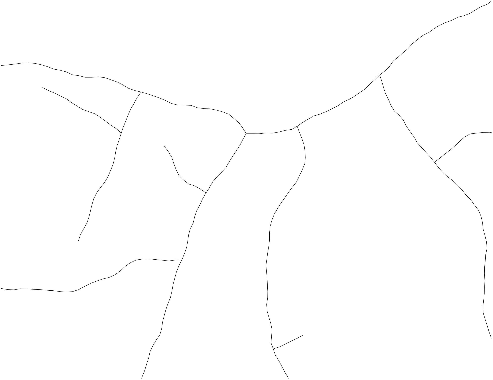
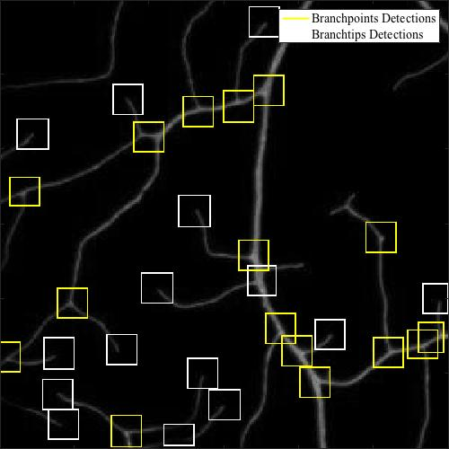

# Object detector for neurons
An object detector to find branch points and branch tips in dendritic trees of neurons.

The network uses the architecture of the [Single Shot MultiBox Detector](http://arxiv.org/abs/1512.02325) proposed in 2016 by Wei Liu, Dragomir Anguelov, Dumitru Erhan, Christian Szegedy, Scott Reed, Cheng-Yang, and Alexander C. Berg. 

The codebase is built upon the [PyTorch implementation](https://github.com/amdegroot/ssd.pytorch) of [amdegroot](https://github.com/amdegroot).


### Table of Contents
- <a href='#installation'>Installation</a>
- <a href='#datasets'>Dataset</a>
- <a href='#performance'>Performance</a>
- <a href='#training'>Training</a>
- <a href='#evaluation'>Evaluation</a>
- <a href='#future-work'>Future Work</a>
- <a href='#references'>Reference</a>

&nbsp;


&nbsp;

## Installation
- Install [PyTorch](http://pytorch.org/)
- Clone this repository
- Download pre-trained networks for further training and evaluation. Save files in the `weights` folder.
    *  Download [weights](https://drive.google.com/file/d/1LjuoPs_zdqkmXjbZgEJVwlpnKEGRHtML/view?usp=sharing) of the pre-trained VGG network
    * Download [weights](https://drive.google.com/file/d/1PPl7rwnXNftI0teAyBO3dg2uvtfqTh_i/view?usp=sharing) of the network trained on neuron images.

- [Optional] Install [Visdom](https://github.com/facebookresearch/visdom) for real-time loss visualization during training.
  ```Shell
    # Install the Python server and client
    pip install visdom
  ```
  During training, start the server with:
  ```Shell
    python -m visdom.server
  ```
  Then navigate to http://localhost:8097/.

## Dataset
In the latest iteration, the network was trained on a set of simulated neuron images synthesized separately (link coming soon...). First, a skeleton of the neuron is generated and the position of the objects is saved:

  

Then, a set of processes is ran to simulate observing conditions that create a gray-scale image:


The main advantage of the simulated dataset is the fact that ground truth locations are automatically generated and not produced by manual detections.

## Performance
After training on a set of 25 generated neuron images, here are typical examples of the network's performance:

<p float="left">
  
  
  
</p>

Given that the network is trained on simulated images, which do not contain all of the image features of real neurons, it performs surprisingly well on real images!


## Training
To train the network on your own dataset, you must collect a matching set of images and ground truth bounding boxes. Images must be 300x300 pixels in JPEG format and the bounding boxes information must be saved in CSV format.

Assuming that the dataset main folder is `DATASET`, the images must be stored in the images subfolder (`DATASET/images`) and the bounding boxes must be stored in the bounding boxes subfolder (`DATASET/bounding_boxes`).

The bounding boxes CSV must contain the header `xmin,xmax,ymin,ymax,class`, which identifies the bounding box `x` and `y` limits in the associated image and the `class` of the object where `0 = branchpoints` and `1 = branchtips`. Here is an example:


**IMPORTANT** <br />
**The filename of each image must match the filename of the bounding box CSVs.**

Once the dataset is setup, run `config.py` with the dataset absolute path name to specify the training and evaluation configurations. The configuration files are saved in `data/config` by default.

See `train.py` to see the complete set of options.

## Evaluation
To evaluate a trained network, run `eval.py` specifying the appropriate configuration file. By default, the detection is run on all JPEG images in the `images` subfolder of the dataset folder.

In the `eval` section of the configuration file, the value of the key `model_name` specifies the filename of the network weights that are used.

The detection results are saved in the `detections` subfolder under the dataset folder.


## Future Work
* [ ] Add support for images of arbitrary size
* [ ] Increase the size of the training set with more synthetic features
* [ ] Compare the network's performance against manual detections

## References
- [Wei Liu, et al. "SSD: Single Shot MultiBox Detector."](http://arxiv.org/abs/1512.02325)
- [SSD PyTorch Implementation](https://github.com/amdegroot/ssd.pytorch)
